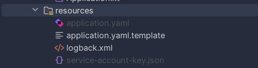

# Recipe Management API

This API allows you to manage recipes through CRUD operations (Create, Read, Update, Delete). Users can create an account, log in, obtain a JWT token to securely access protected resources, and interact with recipe-related functionalities. Some features are accessible without authentication.

---

## Features

### User Management
- **Create an Account**: Register a new user.
- **Login**: Authenticate a user and retrieve a JWT token.
- **JWT-Based Protection**: Secure access to protected resources using JSON Web Tokens.

### Recipe Management
- **Accessible without Authentication**:
    - View all recipes.
    - Search for recipes by keywords.

- **Requires Authentication**:
    - Add a new recipe.
    - Update an existing recipe.
    - Delete a recipe.
    - Like a recipe.
    - Add a comment to a recipe.

---

## Prerequisites

- **Java 21**.
- Build tool (Gradle).
- An environment set up for running Kotlin/Java applications.
- A configuration file (`application.yaml`).
- Postgresql with a database, you can run it from Docker.
- Firebase project with a storage feature to upload an image.

---

## Installation and Setup

### Installation Steps

1. **Clone the repository**:
   ```bash
   git clone https://github.com/RosvaldeMANFO/Cook.git
   cd Cook
   ```

2. **Configure the application**:
    - Rename the `application.yaml.template` file located in the `resources` directory to `application.yaml`.
    - Fill in the necessary fields (e.g., database information, JWT keys, etc.).
    - Add the service-account-key.json of your firebase project from your GCP account to the ``resources`` folder   
   


3. **Build the project**:
      ```bash
      ./gradlew build
      ```

4. **Run the application**:
      ```bash
      ./gradlew run
      ```

---

## Usage

### Authentication
- Secure routes require a **JWT token**. Retrieve it via the login endpoint.
- Include the token in the `Authorization` header of your protected requests like so:
  ```
  Authorization: Bearer <your-jwt-token>
  ```

### Testing Endpoints
A Postman collection is available to test the API endpoints. Use the following link to access it:
[Postman Collection](https://www.postman.com/projetweb-7687/workspace/open-api/request/19898948-1c60b973-99d4-4e40-b61d-ade75d4eb64b?action=share&creator=19898948&ctx=documentation)

---

## Key Endpoints

### User Management
- **POST** `/auth/register`: Register a new user.
- **POST** `/auth/login`: Log in and retrieve a JWT token.

### Recipes (no authentication required)
- **GET** `/recipes`: Retrieve all recipes.
- **GET** `/recipes/search`: Search for recipes using a keyword.

### Recipes (authentication required)
- **POST** `/recipes`: Add a new recipe.
- **PUT** `/recipes/{id}`: Update a recipe.
- **DELETE** `/recipes/{id}`: Delete a recipe.
- **POST** `/recipes/{id}/like`: Like a recipe.
- **POST** `/recipes/{id}/comment`: Add a comment to a recipe.

---

## Notes

Be sure to fill in all required fields in the `application.yaml` file to ensure the project functions correctly.
